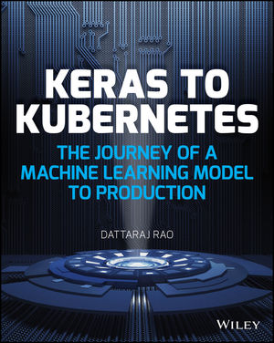
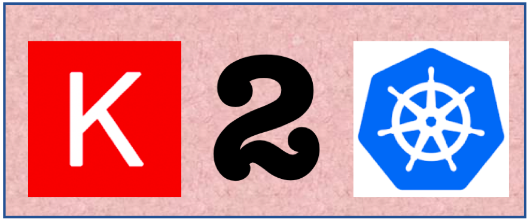

## Keras to Kubernetes: The Journey of a Machine Learning Model to Production
#### by [Dattaraj Jagdish Rao](mailto:dattarajrao@yahoo.com) - Book releasing April 2019

We have seen an exponential growth in the use of Artificial Intelligence (AI) over last few years. AI is becoming the new electricity and is touching every industry from retail to manufacturing to healthcare to entertainment. Within AI, we’re seeing a particular growth in Machine Learning (ML) and Deep Learning (DL) applications. ML is all about learning relationships from labeled (Supervised) or unlabeled data (Unsupervised). DL has many layers of learning and can extract patterns from unstructured data like images, video, audio, etc.

Keras to Kubernetes: The Journey of a Machine Learning Model to Production  takes you through real-world examples of building DL models in Keras for recognizing product logos in images and extracting sentiment from text. You will then take that trained model and package it as a web application container before learning how to deploy this model at scale on a Kubernetes cluster. You will understand the different practical steps involved in real-world ML implementations which go beyond the algorithms.

* Find hands-on learning examples

* Learn to uses Keras and Kubernetes to deploy Machine Learning models

* Discover new ways to collect and manage your image and text data with Machine Learning

* Reuse examples as-is to deploy your models

* Understand the ML model development lifecycle and deployment to production

If you’re ready to learn about one of the most popular DL frameworks and build production applications with it, you’ve come to the right place. Below is the table of contents for the book and supported code from the book for your reference.

## <a href="https://www.wiley.com/en-us/Keras+to+Kubernetes%3A+The+Journey+of+a+Machine+Learning+Model+to+Production+-p-9781119564836">Keras to Kubernetes: The Journey of a Machine Learning Model to Production</a>

* INTRODUCTION

* Chapter 1: BigData & Artificial Intelligence

* <a href="Chapter 2 - Machine Learning.ipynb">Chapter 2: Machine Learning</a>

* <a href="Chapter 3 - Handling Unstructured Data.ipynb">Chapter 3: Handling Unstructured Data</a>

* <a href="Chapter 4 - Deep Learning using Keras.ipynb">Chapter 4: Deep Learning using Keras</a>

* <a href="Chapter 5 - Advanced Deep Learning.ipynb">Chapter 5: Advanced Deep Learning</a>

* Chapter 6: Cutting-Edge Deep Learning Projects
    * <a href="Keras_2_Kubernetes_Chapter_6_Dattaraj_J_Rao_Neural_Style_Transfer_demo.ipynb">Neural Style Transfer demo</a>
    * <a href="Keras_2_Kubernetes_Chapter_6_Dattaraj_J_Rao_Generative_Adversarial_Networks.ipynb">Generative Adversarial Networks</a>

* Chapter 7: AI in the Modern Software World

* Chapter 8: Deploying AI Models as a Microservice

* <a href="Chapter 9 - Machine Learning Development Lifecycle.ipynb">Chapter 9: Machine Learning Development Lifecycle</a>

* Chapter 10: A Platform for Machine Learning

* Appendix A: REFERENCES

## Keras 2 Kubernetes - Free Utility

This is an Open Source project that tries to bridge the gap between Data Scientists and Software Developers. Keras is the most popular Deep Learning framework that allows Data Scientists to build and validate models on image data. Model that can learn to Classify images are stored as H5 files. Using Keras2Kubernetes these models can be easily packaged into Docker containers with a single command and deployed as microservices.

Command:
>> `docker run -p <<your port>>:7001 -v /mypath:/model dattarajrao/keras2kubernetes`

Here port 7001 is the port the container exposes - you can change to port on your machine. Describe a folder on your machine with a Keras model file named as 'model.h5'. The Docker container will start serving model from this folder (name has to be model.h5).

You can test the application by pointing your browser to:
`http://localhost:7001`

or use CURL command to validate the model as API:
>> `curl --form image=@/mymachinepath/image.jpg http://localhost:7001/inference`

also - JSON description of the model is available at:
`http://localhost:7001/model`

This can easily be packaged as a Kubernetes deployment and service using the following YAML file:
`https://github.com/dattarajrao/keras2kubernetes/blob/master/deploy2k8s.yaml`

Please send across any questions, comments and feedback to:
[Dattaraj Rao](mailto:dattarajrao@yahoo.com)
